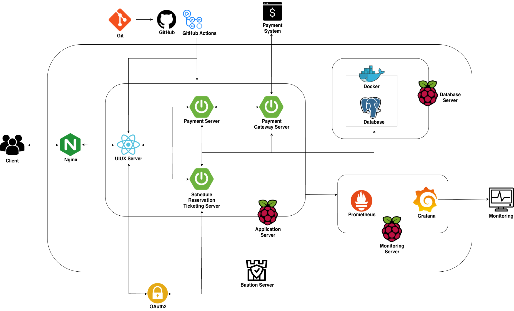
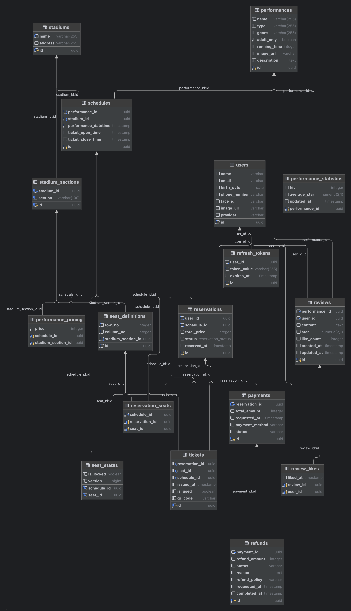

# 🎫 NextFrame: 공연장 좌석 예매 서비스

[](https://docs.oracle.com/en/java/javase/21/)
[](https://spring.io/projects/spring-boot)
[](https://www.postgresql.org/)
[](https://www.docker.com/)

> **"대규모 트래픽을 감당할 수 있는 견고한 티켓팅 서비스"**
>
> NextFrame은 사용자가 원하는 공연의 일정과 좌석을 선택하고 결제하여 QR 티켓을 발급받는 예매 플랫폼입니다.

## 📝 Table of Contents
1. [Links](#-links)
2. [Project Overview](#-project-overview)
3. [Team Members](#-team-members)
4. [Tech Stack](#-tech-stack)
5. [System Architecture & ERD](#-system-architecture--erd)
6. [Collaboration Rules](#-collaboration-rules-ground-rules)

## 🔗 Links
- **Service URL:** [https://nextframe.wisoft.dev/](https://nextframe.wisoft.dev/)
- **API Documentation:** [Swagger UI Docs](https://next-frame-lab.github.io/swagger-ui-docs/)

## 📅 Project Overview
### 기획 배경
티켓팅 서비스는 특정 시간에 트래픽이 증가하는 대표적인 도메인입니다. **NextFrame**은 단순한 기능 구현을 넘어, 대규모 트래픽 상황에서도 데이터 정합성을 유지하고 안정적인 서비스를 제공할 수 있는 견고한 백엔드 시스템을 구축하기 위해 시작되었습니다.

### 주요 기능
*   소셜 로그인, 공연 검색/목록/상세 조회, 좌석 선택 및 예매
*   결제, QR 티켓 발급, 리뷰 작성(좋아요)

## 👥 Team Members
| 이름 | Role | GitHub | 담당 역할 |
|:---:|:---:|:---:|:---|
| **김민서** | Team Leader <br> Backend | [@git-mesome](https://github.com/git-mesome) | • **좌석 결제 및 환불 프로세스 구현**<br>• 티켓(QR 코드) 발급 시스템<br>• 공연 검색 기능 고도화 (QueryDSL)<br>• DB/배포/모니터링 환경 구축 및 DB 설계 |
| **안진표** | Team Member <br> Backend | [@Jinpyo-An](https://github.com/Jinpyo-An) | • **공연 좌석 및 예매 프로세스 구현**<br>• 소셜 로그인(OAuth2) 및 JWT 인증/인가<br>• 공연 검색 및 리뷰(좋아요) 기능<br>• 배포 환경 구축 및 API 설계 |

## 🛠 Tech Stack
### Backend
*   **Language:** Java 21
*   **Framework:** Spring Boot 3.5.4
*   **Test:** JUnit5, Mockito
*   **ORM:** JPA, QueryDSL

### Database
*   **RDBMS:** PostgreSQL
*   **NoSQL:** Redis

### Infrastructure & Deployment
*   **Server:** On-Premise
*   **Virtualization:** Docker
*   **CI/CD:** GitHub Actions
*   **Web Server(Reverse Proxy):** Nginx

## 📐 System Architecture & ERD
> 현재 아키텍처와 DB 설계도는 지속적으로 고도화 중입니다.

### System Architecture
<details>
<summary><b>👉 시스템 아키텍처 구성도 펼쳐보기</b></summary>
<br>



</details>

<br>

1. 서비스 독립 분리 및 API 라우팅
- Payment, Schedule-Reservation-Ticketing, Payment-Gateway 어플리케이션 독립 운영
- Nginx Reverse Proxy: React 정적 리소스 및 백엔드 API 단일 진입점(Single Entry Point) 구성
- 통신 프로토콜: 서비스 간 REST API 표준 인터페이스 적용

2. CI/CD
- 조건부 빌드: changed-files 액션을 통한 변경 모듈 감지 및 선별적 빌드/배포
- Bastion 터널링: 내부망 환경 보안을 위한 SSH 터널링 기반 아티팩트(.jar) 전송

3. Database
- 분산 락(Redisson): Redis 기반 락 구현으로 좌석 예매 시 발생하는 Race Condition 방지
- 데이터 캐싱: 조회 빈도가 높은 공연 정보 Redis 캐싱을 통한 DB 부하 감소 및 응답 속도 개선
- 데이터 통합 관리: PostgreSQL 통합 DB 구성을 통한 분산 환경 내 데이터 정합성 유지

4. 보안 및 모니터링
- 네트워크 격리: Bastion Server를 경유한 SSH 접근 제어 (내부망 격리)
- 인증/인가: OAuth 2.0 기반 소셜 로그인 및 JWT 토큰 검증
- 가시성 확보: Prometheus/Grafana/Loki 스택을 활용한 메트릭(CPU, Memory) 및 API 처리 현황 실시간 모니터링

### ERD (Entity Relationship Diagram)
<details>
<summary><b>👉 ERD (DB 설계도) 펼쳐보기</b></summary>
<br>



</details>

## 🤝 Collaboration Rules (Ground Rules)
NextFrame 팀은 명확한 규칙을 통해 코드 품질을 유지하고 협업 효율을 높입니다.

### 1. Git Strategy
*   **Git Flow** 전략을 따릅니다. (`main`, `develop`, `feature`, `release`, `hotfix`)
*   **Merge Strategy:** `Rebase and Merge`를 사용하여 커밋 히스토리를 깔끔하게 관리합니다.

### 2. Code Convention
*   [Naver Java Coding Convention](https://naver.github.io/hackday-conventions-java/)을 준수합니다.

### 3. Commit Message Convention
이슈 트래킹을 위해 아래 템플릿을 엄격히 준수합니다.

```text
#<이슈번호> <타입>(<범위>): <제목> (제목은 40자 이내)

<본문> (선택 사항, 한 줄 띄우고 작성. 72자 이내로 줄 바꿈)

Resolves: #<이슈번호>
See also: None (관련 항목이 있으면 #<이슈번호> 기입)